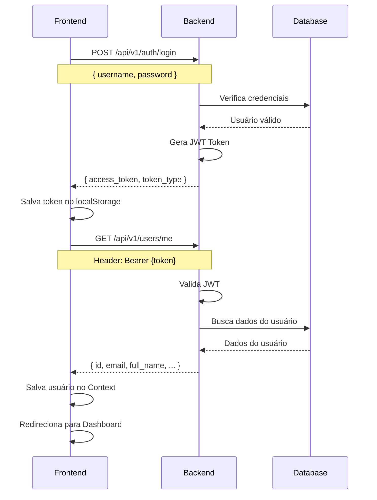

# 🔗 Guia de Integração - Backend ↔️ Frontend

Este guia detalha como o backend FastAPI se comunica com o frontend React.

---

## 📋 Sumário

- [Visão Geral](#visão-geral)
- [Arquitetura da Integração](#arquitetura-da-integração)
- [Fluxo de Autenticação](#fluxo-de-autenticação)
- [Integração de Endpoints](#integração-de-endpoints)
- [Tratamento de Erros](#tratamento-de-erros)
- [Configuração de CORS](#configuração-de-cors)
- [WebSockets (Futuro)](#websockets-futuro)

---

## 🎯 Visão Geral

O sistema utiliza uma arquitetura **REST API** onde:

- **Backend (FastAPI):** Expõe endpoints HTTP em `http://localhost:8000/api/v1`
- **Frontend (React):** Consome a API via Axios
- **Comunicação:** JSON via HTTP/HTTPS
- **Autenticação:** JWT (JSON Web Tokens)

```
┌─────────────┐         HTTP/JSON        ┌─────────────┐
│   FRONTEND  │ ◄──────────────────────► │   BACKEND   │
│  React/TS   │                          │   FastAPI   │
│ Port: 5173  │                          │  Port: 8000 │
└─────────────┘                          └─────────────┘
```

---

## 🏗️ Arquitetura da Integração

### **Backend (FastAPI)**

```
backend/
├── app/
│   ├── api/v1/              # Endpoints REST
│   │   ├── auth.py          # Login/Registro
│   │   ├── customers.py     # CRUD Clientes
│   │   ├── products.py      # CRUD Produtos
│   │   └── orders.py        # CRUD Pedidos
│   ├── services/            # Lógica de negócio
│   │   └── whatsapp.py      # Integração WhatsApp
│   └── main.py              # Configuração CORS
```

### **Frontend (React)**

```
frontend/
├── src/
│   ├── services/            # Comunicação com API
│   │   ├── api.ts           # Configuração Axios
│   │   ├── auth.ts          # Serviços de Auth
│   │   ├── customers.ts     # Serviços de Clientes
│   │   ├── products.ts      # Serviços de Produtos
│   │   └── orders.ts        # Serviços de Pedidos
│   ├── context/
│   │   └── AuthContext.tsx  # Gerenciamento de Auth
│   └── pages/               # Páginas que consomem API
```

---

## 🔐 Fluxo de Autenticação

### **Passo a Passo:**



### **Código Backend (FastAPI):**

```python
# backend/app/api/v1/auth.py

@router.post("/login", response_model=Token)
def login(
    form_data: OAuth2PasswordRequestForm = Depends(),
    db: Session = Depends(get_db)
):
    user = db.query(User).filter(User.email == form_data.username).first()
    
    if not user or not verify_password(form_data.password, user.hashed_password):
        raise HTTPException(status_code=401, detail="Credenciais inválidas")
    
    access_token = create_access_token(data={"sub": str(user.id)})
    return {"access_token": access_token, "token_type": "bearer"}
```

### **Código Frontend (React):**

```typescript
// frontend/src/services/auth.ts

export const authService = {
  async login(credentials: LoginCredentials): Promise<AuthResponse> {
    const formData = new FormData()
    formData.append('username', credentials.username)
    formData.append('password', credentials.password)

    const { data } = await api.post<AuthResponse>('/auth/login', formData, {
      headers: { 'Content-Type': 'application/x-www-form-urlencoded' }
    })
    return data
  },

  async getCurrentUser(): Promise<User> {
    const { data } = await api.get<User>('/users/me')
    return data
  }
}
```

### **Token JWT no localStorage:**

```typescript
// Salvar token
localStorage.setItem('token', 'eyJhbGciOiJIUzI1NiIsInR5cCI6IkpXVCJ9...')

// Obter token
const token = localStorage.getItem('token')

// Remover token (logout)
localStorage.removeItem('token')
```

---

## 📡 Integração de Endpoints

### **1. Listar Clientes**

**Backend:**
```python
# GET /api/v1/customers/
@router.get("/", response_model=List[CustomerResponse])
def list_customers(
    skip: int = 0,
    limit: int = 100,
    db: Session = Depends(get_db),
    current_user: User = Depends(get_current_user)
):
    customers = db.query(Customer).offset(skip).limit(limit).all()
    return customers
```

**Frontend:**
```typescript
// frontend/src/services/customers.ts
export const customerService = {
  async getAll(skip = 0, limit = 100): Promise<Customer[]> {
    const { data } = await api.get<Customer[]>('/customers/', {
      params: { skip, limit }
    })
    return data
  }
}

// Uso em componente
const customers = await customerService.getAll()
```

---

### **2. Criar Pedido (com WhatsApp)**

**Backend:**
```python
# POST /api/v1/orders/
@router.post("/", response_model=OrderResponse)
async def create_order(
    order_data: OrderCreate,
    db: Session = Depends(get_db),
    current_user: User = Depends(get_current_user)
):
    # Cria pedido
    order = await order_service.create_order(db, order_data)
    
    # Envia WhatsApp automaticamente
    # (feito dentro do order_service)
    
    return order
```

**Frontend:**
```typescript
// frontend/src/services/orders.ts
export const orderService = {
  async create(order: OrderCreate): Promise<Order> {
    const { data } = await api.post<Order>('/orders/', order)
    return data
  }
}

// Uso em componente
const newOrder = await orderService.create({
  customer_id: 1,
  items: [
    { product_id: 1, quantity: 2 }
  ],
  notes: "Entregar pela manhã"
})
```

---

### **3. Concluir Pedido (com WhatsApp)**

**Backend:**
```python
# POST /api/v1/orders/{id}/complete
@router.post("/{order_id}/complete", response_model=OrderResponse)
async def complete_order(
    order_id: int,
    db: Session = Depends(get_db),
    current_user: User = Depends(get_current_user)
):
    order = await order_service.complete_order(db, order_id)
    # WhatsApp enviado automaticamente
    return order
```

**Frontend:**
```typescript
// frontend/src/services/orders.ts
export const orderService = {
  async complete(id: number): Promise<Order> {
    const { data } = await api.post<Order>(`/orders/${id}/complete`)
    return data
  }
}

// Uso
await orderService.complete(orderId)
```

---

## 🚨 Tratamento de Erros

### **Interceptor Axios (Frontend):**

```typescript
// frontend/src/services/api.ts

// Adiciona token automaticamente
api.interceptors.request.use((config) => {
  const token = localStorage.getItem('token')
  if (token && config.headers) {
    config.headers.Authorization = `Bearer ${token}`
  }
  return config
})

// Trata erros 401 (token expirado)
api.interceptors.response.use(
  (response) => response,
  (error) => {
    if (error.response?.status === 401) {
      localStorage.removeItem('token')
      localStorage.removeItem('user')
      window.location.href = '/login'
    }
    return Promise.reject(error)
  }
)
```

### **Tratamento de Erros em Componentes:**

```typescript
try {
  await customerService.create(customerData)
  alert('Cliente criado com sucesso!')
} catch (error: any) {
  const message = error.response?.data?.detail || 'Erro ao criar cliente'
  alert(message)
  console.error('Erro:', error)
}
```

---

## 🌐 Configuração de CORS

### **Backend (FastAPI):**

```python
# backend/app/main.py

from fastapi.middleware.cors import CORSMiddleware

app.add_middleware(
    CORSMiddleware,
    allow_origins=settings.origins_list,  # ["http://localhost:5173"]
    allow_credentials=True,
    allow_methods=["*"],
    allow_headers=["*"],
)
```

### **Variáveis de Ambiente:**

```env
# backend/.env
ALLOWED_ORIGINS=http://localhost:3000,http://localhost:5173
```

### **Verificar CORS:**

Se você vir este erro no console do navegador:
```
Access to XMLHttpRequest at 'http://localhost:8000/api/v1/...' 
from origin 'http://localhost:5173' has been blocked by CORS policy
```

**Solução:**
1. Adicione a origem no `backend/.env`
2. Reinicie o backend

---

## 📊 Tabela de Integração

| Funcionalidade | Backend Endpoint | Frontend Service | Componente |
|----------------|------------------|------------------|------------|
| **Login** | `POST /auth/login` | `authService.login()` | `Login.tsx` |
| **Dados Usuário** | `GET /users/me` | `authService.getCurrentUser()` | `AuthContext.tsx` |
| **Listar Clientes** | `GET /customers/` | `customerService.getAll()` | `Customers.tsx` |
| **Criar Cliente** | `POST /customers/` | `customerService.create()` | `Customers.tsx` |
| **Listar Produtos** | `GET /products/` | `productService.getAll()` | `Products.tsx` |
| **Criar Produto** | `POST /products/` | `productService.create()` | `Products.tsx` |
| **Listar Pedidos** | `GET /orders/` | `orderService.getAll()` | `Orders.tsx` |
| **Criar Pedido** | `POST /orders/` | `orderService.create()` | `Orders.tsx` |
| **Concluir Pedido** | `POST /orders/{id}/complete` | `orderService.complete()` | `OrderCard.tsx` |

---

## 🔄 Fluxo Completo: Criar Pedido

```
1. Usuário preenche formulário
   ↓
2. Frontend valida dados (React Hook Form)
   ↓
3. Frontend chama orderService.create(orderData)
   ↓
4. Axios interceptor adiciona token JWT
   ↓
5. POST /api/v1/orders/ com Authorization header
   ↓
6. Backend valida token JWT
   ↓
7. Backend valida dados (Pydantic)
   ↓
8. Backend cria pedido no PostgreSQL
   ↓
9. Backend busca dados do cliente
   ↓
10. Backend chama WhatsApp API
    ↓
11. WhatsApp envia mensagem ao cliente
    ↓
12. Backend retorna pedido criado (JSON)
    ↓
13. Frontend recebe resposta
    ↓
14. Frontend mostra alerta "Pedido criado! WhatsApp enviado"
    ↓
15. Frontend recarrega lista de pedidos
```

---

## 🔮 WebSockets (Futuro)

Para notificações em tempo real, podemos adicionar WebSockets:

**Backend:**
```python
from fastapi import WebSocket

@app.websocket("/ws")
async def websocket_endpoint(websocket: WebSocket):
    await websocket.accept()
    # Enviar atualizações em tempo real
```

**Frontend:**
```typescript
const ws = new WebSocket('ws://localhost:8000/ws')

ws.onmessage = (event) => {
  const data = JSON.parse(event.data)
  // Atualizar UI em tempo real
}
```

---

## ✅ Checklist de Integração

- [ ] Backend rodando em http://localhost:8000
- [ ] Frontend rodando em http://localhost:5173
- [ ] CORS configurado corretamente
- [ ] Token JWT sendo enviado em requisições
- [ ] Erro 401 redireciona para login
- [ ] Criar pedido envia WhatsApp
- [ ] Concluir pedido envia WhatsApp
- [ ] Todas as rotas protegidas funcionando

---

## 📞 Debug de Integração

### **Ver requisições no navegador:**

1. Abra DevTools (F12)
2. Vá na aba **Network**
3. Filtre por **XHR** ou **Fetch**
4. Clique em uma requisição
5. Veja:
   - **Headers:** Token JWT está sendo enviado?
   - **Payload:** Dados estão corretos?
   - **Response:** O que o backend retornou?

### **Ver logs do backend:**

```bash
# No terminal do backend você verá:
INFO:     127.0.0.1:52134 - "POST /api/v1/orders/ HTTP/1.1" 201 Created
```

### **Testar endpoint manualmente:**

```bash
# Obter token
curl -X POST "http://localhost:8000/api/v1/auth/login" \
  -H "Content-Type: application/x-www-form-urlencoded" \
  -d "username=admin@teste.com&password=senha123"

# Usar token em requisição
curl -X GET "http://localhost:8000/api/v1/customers/" \
  -H "Authorization: Bearer SEU_TOKEN_AQUI"
```

---

## 🎯 Conclusão

A integração está completa quando:

✅ Frontend consegue fazer login  
✅ Frontend consegue criar clientes  
✅ Frontend consegue criar produtos  
✅ Frontend consegue criar pedidos  
✅ WhatsApp é enviado automaticamente  
✅ Todas as rotas protegidas funcionam  

Para mais informações, consulte:
- `TEST_CONNECTION.md` - Testes passo a passo
- `README.md` - Documentação geral
- http://localhost:8000/docs - Swagger UI